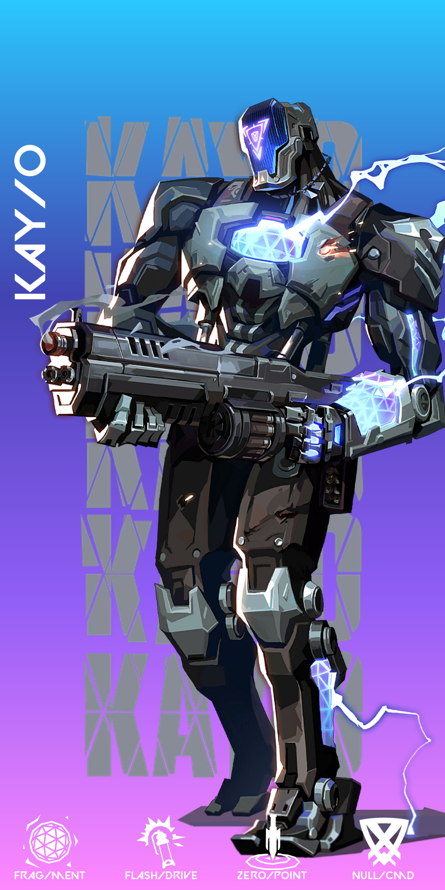

# valorant-api
A Python wrapper for valorant-api.com

[](https://pypi.python.org/pypi/valorant-api/)
[](https://pepy.tech/project/valorant-api)

# Installation
<!-- `pip install git+https://github.com/MinshuG/valorant-api` \
or \ -->
`pip install valorant-api`

# Usages
```py
# this code is just for reference

from valorant_api import SyncValorantApi, AsyncValorantApi

#sync
api = SyncValorantApi(language="ru-RU")
agents = api.get_agents()

#Async
api = AsyncValorantApi(language="ru-Ru")
agents = await api.get_agents()

# searching
agent = agents.find_where(displayname="Raze", developerName="Gumshoe")
agent = agents.find_first(displayname="Raze")

# agents image generation
from valorant_api import generators

font_file = r"valorant_api\fonts\Valorant Font.ttf"
# initialize class
generator = generators.AgentImageGenerator(font_file)
# generator actual image
image = await generator.generate(agent)
# save the image
image.save("image.png", "PNG")
```
# Agents Image Example

<!--  -->

# Requirements

* python-dateutil
* aiohttp
* requests
* Pillow